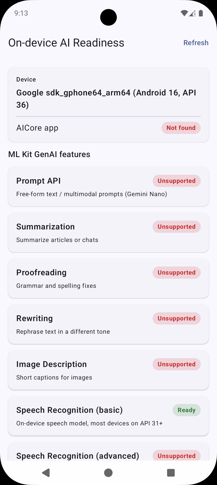
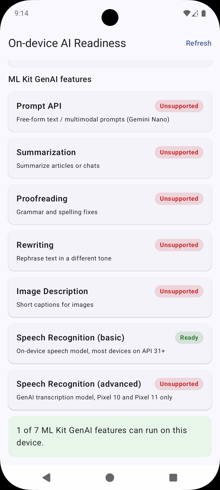

# GenAI Readiness

An Android app that tells you, at a glance, whether a device can actually run Google's
**ML Kit GenAI** features on-device, before you ship a feature that only works on a
handful of phones.

Most "is this device supported?" answers online stop at *"does it have AICore?"*. That is
not enough. A device needs AICore **and** to be on Google's allow-list with a locked
bootloader. This app asks each ML Kit GenAI feature directly via `checkStatus()` /
`checkFeatureStatus()` and reports the real answer.

## Screenshots

| Device & AICore status | Per-feature readiness |
| --- | --- |
|  |  |

## What it checks

Each ML Kit GenAI feature is probed individually and reported as **Ready**, **Needs
download**, **Downloading**, **Unsupported**, or **Error**:

- **Prompt API** — free-form text / multimodal prompts (Gemini Nano)
- **Summarization** — summarize articles or chats
- **Proofreading** — grammar and spelling fixes
- **Rewriting** — rephrase text in a different tone
- **Image Description** — short captions for images
- **Speech Recognition (basic)** — on-device speech model, most devices on API 31+
- **Speech Recognition (advanced)** — GenAI transcription model, Pixel 10 / Pixel 11 only

The screen also shows the device model, Android version / API level, and whether the
**AICore** app (`com.google.android.aicore`) is installed along with its version.

A summary card at the bottom states how many features can run on the device. When none
can, it points you at a self-hosted model (LiteRT-LM / Gemma) as the fallback.

## How it works

- `ReadinessViewModel` runs each feature check in sequence and streams results into the UI
  state as they complete (`CHECKING` → final status per feature).
- Each check builds the feature's options object, calls the ML Kit client, and reads its
  status, closing the client afterwards.
- `ReadinessScreen` renders the device card, one card per feature, and the verdict card
  using Jetpack Compose + Material 3.

## Requirements

- Android Studio (latest stable) with **Android SDK 37**
- **JDK 11+**
- A physical device running Android 12+ for meaningful results (emulators report most
  features as unsupported)
- Somewhere on-device to run the app; an AICore-capable device (e.g. recent Pixel) gives a
  fully "Ready" board

## Build & run

```bash
./gradlew :app:installDebug
```

Then launch **GenAI Readiness** and tap **Refresh** to re-run the checks.

## Tech stack

- Kotlin 2.2.10, Jetpack Compose (Material 3)
- ML Kit GenAI: `genai-prompt`, `genai-summarization`, `genai-proofreading`,
  `genai-rewriting`, `genai-image-description`, `genai-speech-recognition`
- AGP 9.4.1, `compileSdk` / `targetSdk` 37, `minSdk` 26
- AndroidX Lifecycle ViewModel + `kotlinx-coroutines-guava`
